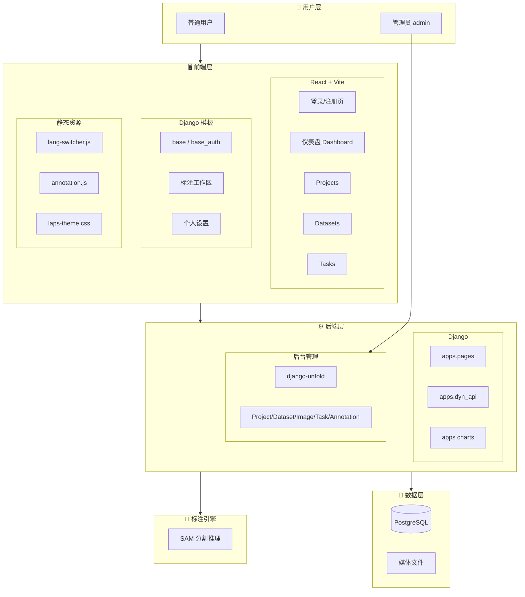
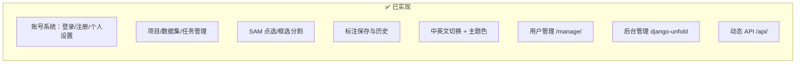
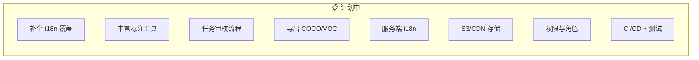
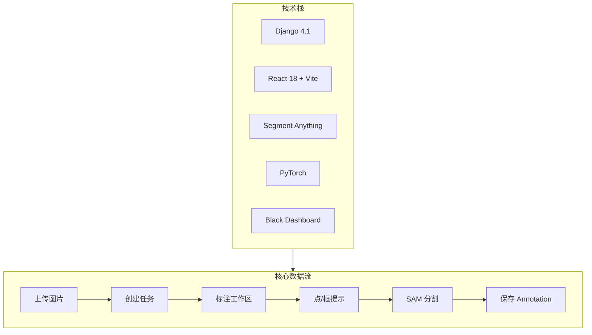

# LAPS-System 项目架构图

> 轻量交互式图像标注系统 · Django + React + SAM

标注数据流、与 Label Studio 的对照及前后台 CRUD 范围见 **[docs/WORKFLOW.md](docs/WORKFLOW.md)**。

---

## 总览架构



> 💡 在 GitHub、VS Code、Typora 等支持 Mermaid 的编辑器中可渲染为可视化图表。

---

## 已实现功能



| 模块 | 实现 | 说明 |
|------|------|------|
| **认证** | ✅ | 自定义登录/注册、admin 身份选择、用户管理 |
| **仪表盘** | ✅ | KPI、最近任务、快捷入口、空状态引导 |
| **项目管理** | ✅ | 创建/编辑/删除、标签配置 |
| **数据集** | ✅ | 上传图片、图片列表 |
| **任务** | ✅ | 任务队列、/tasks/next/、分配 |
| **标注** | ✅ | 点/框提示 → SAM → 遮罩、撤销/清除/保存 |
| **国际化** | ✅ | 客户端 data-en/data-zh、后台 gettext |
| **主题** | ✅ | 深色/浅色、红/蓝/绿主题色 |
| **后台** | ✅ | unfold、Project/Dataset/Image/Task/Annotation |

---

## 计划实现功能



| 优先级 | 功能 | 说明 |
|--------|------|------|
| **优先** | 补全 i18n | 项目/数据集/任务/页脚 data-en/data-zh |
| **优先** | SAM FutureWarning | torch.load 安全加载 |
| **优先** | 单元/集成测试 | /tasks/next/、/segment-image/、/api/annotations/ |
| **重要** | 丰富标注工具 | 多边形、画笔、边界框、标签管理 |
| **重要** | 任务审核流程 | 分配/审核/回退/历史 |
| **重要** | 导出/导入 | COCO、PascalVOC、CSV |
| **可选** | 服务端 i18n | Django gettext 迁移 |
| **可选** | 存储优化 | S3、CDN、缓存、分页 |
| **可选** | 权限角色 | admin/annotator/reviewer |
| **可选** | CI/CD | GitHub Actions、自动化测试 |

---

## 技术栈与数据流



---

## 目录结构概览

```
LAPS-System/
├── apps/
│   ├── pages/          # 主应用：模型、视图、admin、SAM 推理
│   ├── dyn_api/        # 动态 REST API
│   └── charts/         # 图表
├── config/             # Django 配置、URL
├── frontend/           # React 源码（Vite 构建）
├── static/             # 静态资源、构建产物
├── templates/          # Django 模板、unfold 覆盖
├── locale/             # 后台 i18n (zh_Hans, en)
├── media/              # MEDIA_ROOT（运行时生成，见 .gitignore）；数据集图片在 media/datasets/user_<owner_id>/%Y/%m/%d/
├── sam/                # SAM 模型权重（.gitignore）
```

---

## 一页总览

```
┌─────────────────────────────────────────────────────────────────────────────┐
│                        LAPS-System 轻量图像标注平台                           │
├─────────────────────────────────────────────────────────────────────────────┤
│  👤 用户        │  普通用户：仪表盘 / 项目 / 数据集 / 任务 / 标注              │
│                 │  管理员：/admin/ 后台 + /manage/ 用户管理                     │
├─────────────────┼───────────────────────────────────────────────────────────┤
│  🖥️ 前端        │  React：登录、仪表盘、Projects/Datasets/Tasks               │
│                 │  模板：标注工作区、个人设置、布局 (base/base_auth)           │
│                 │  静态：lang-switcher、annotation.js、laps-theme            │
├─────────────────┼───────────────────────────────────────────────────────────┤
│  ⚙️ 后端        │  apps.pages：核心业务  │  apps.dyn_api：REST API            │
│                 │  apps.charts：图表    │  django-unfold：后台管理            │
├─────────────────┼───────────────────────────────────────────────────────────┤
│  🔬 引擎        │  SAM (Segment Anything)：点/框提示 → 分割 → 遮罩            │
├─────────────────┼───────────────────────────────────────────────────────────┤
│  💾 数据        │  PostgreSQL           │  MEDIA_ROOT：`media/datasets/`、`annotations/` 等 │
└─────────────────┴───────────────────────────────────────────────────────────┘

  ✅ 已实现：账号系统 · 项目管理 · SAM 分割 · 中英文 · 主题 · 用户管理 · 后台
  📋 计划：i18n 补全 · 丰富标注工具 · 任务审核 · 导出 COCO · 权限角色 · CI/CD
```

---

*最后更新：根据 README、TODO 与代码结构整理*
